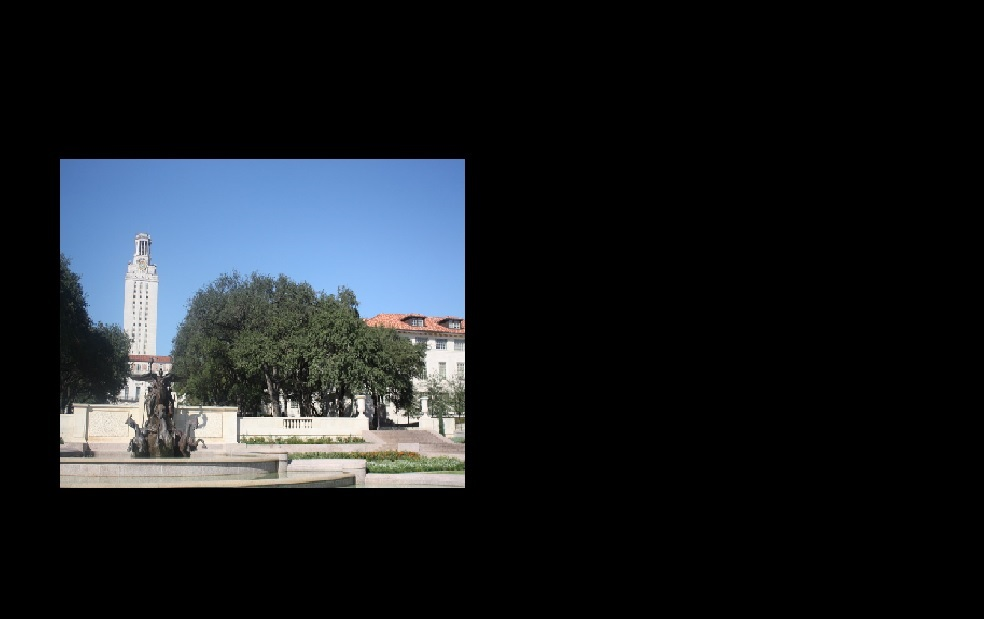
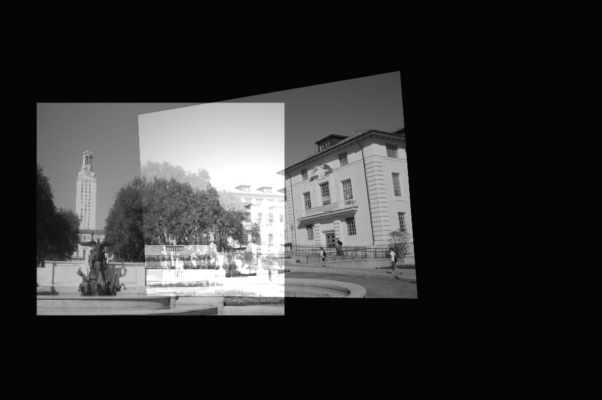

# Image-Stitching
Generate a kind of Panoramic Image using two images (left.jpg, right.jpg). 

Input Left:

Input Right:

Ouput Stitched Image:

Required Pyhon 3 libraries:
1. openCV (I used version 4.0)
2. Numpy

Compile:
> python image_stitching.py

It will generate 2 output images
